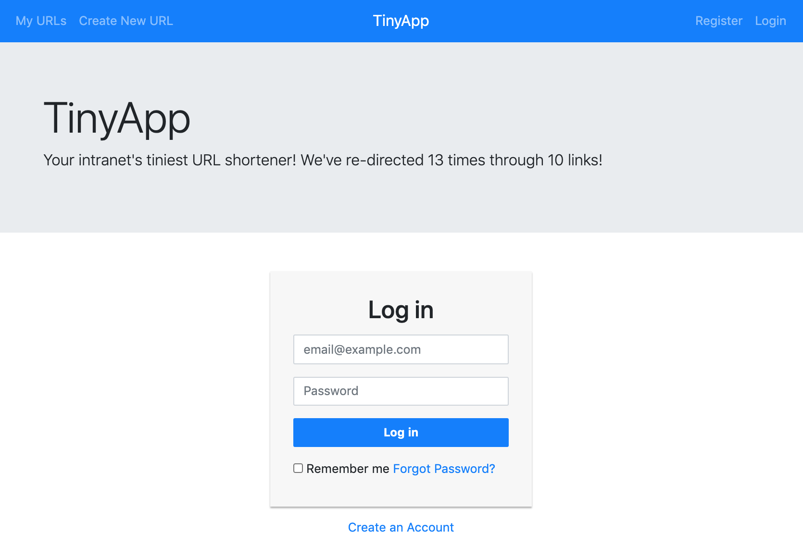
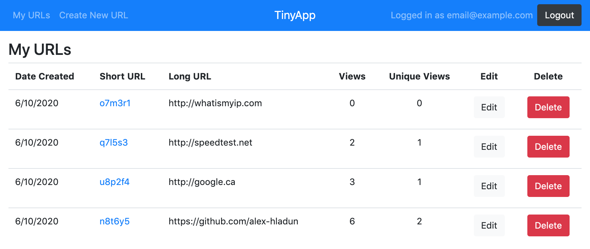
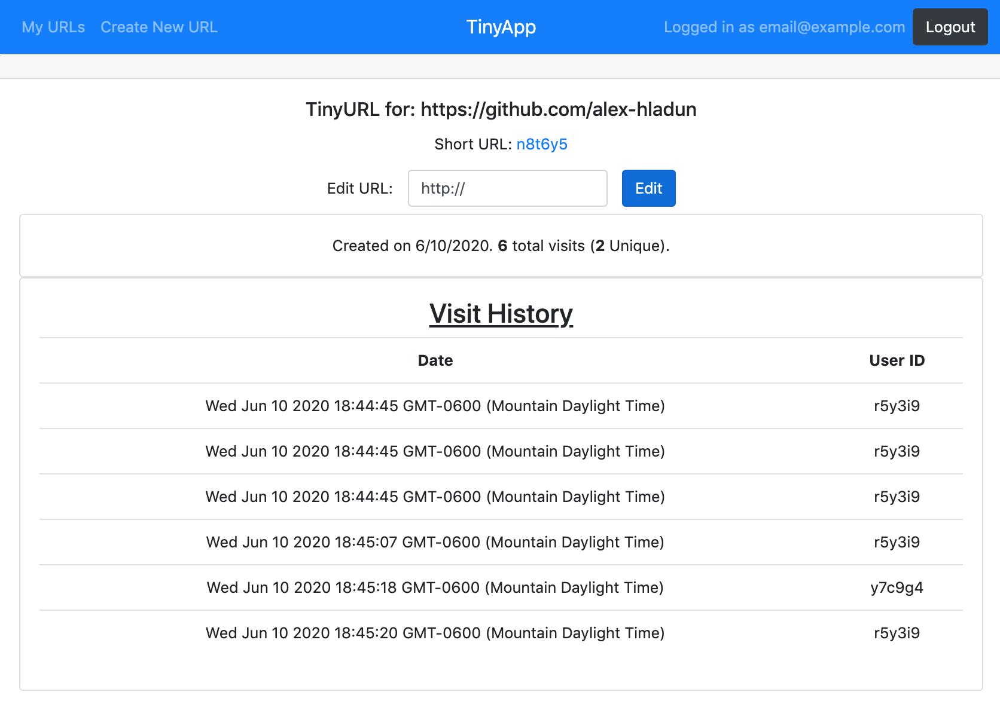

https://stackoverflow.com/questions/53339351/how-to-create-navigation-bar-with-login-sign-up-button-in-bootstrap-4
https://www.tutorialrepublic.com/snippets/preview.php?topic=bootstrap&file=simple-login-forms
https://www.tutorialrepublic.com/codelab.php?topic=bootstrap&file=simple-registration-form

# TinyApp Project

TinyApp is a full stack web application built with Node and Express that allows users to shorten long URLs, similar to [bit.ly](https://bitly.com/). You can login to create and view your shortened links, and have access to analytics such as unique views and view-date.

## Final Product

### Login Page

### URL List

### URL Dashboard

## Dependencies

- Node.js
- Express
- EJS
- bcrypt
- body-parser
- cookie-session
- method-override

## Getting Started

- Install all dependencies (using the `npm install` command).
- Run the development web server using the `node express_server.js` command.